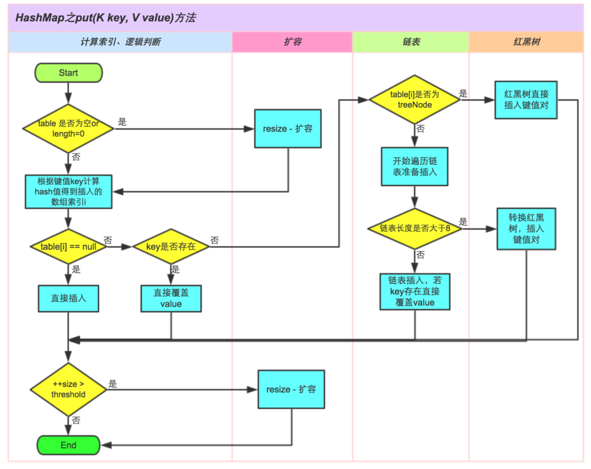
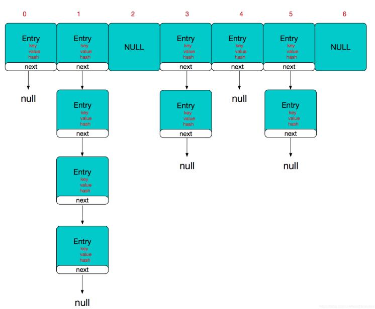

# 第二周总结

## 哈希表

* 定义：以<Key,Value>为元素的数据结构。 快速定位数据,时间复杂度O(1), 常用于优化O(n)的查询。
* 哈希函数：根据key值计算存储位置的函数。
* 冲突：根据不同key值得到相同的函数值。
* 冲突处理：
  1. 链表法：在存储位置存入链表，冲突发生时，添加入链表。
  2. 开放定址法：按照规则占用别的空间。

## HashMap 实现

```节点
transient Entry<K,V>[] table = (Entry<K,V>[]) EMPTY_TABLE;
static class Node<K,V> implements Map.Entry<K,V> {
    final int hash;
    final K key;
    V value;
    Node<K,V> next;

    Node(int hash, K key, V value, Node<K,V> next) {
        this.hash = hash;
        this.key = key;
        this.value = value;
        this.next = next;
    }

    public final K getKey()        { return key; }
    public final V getValue()      { return value; }
    public final String toString() { return key + "=" + value; }

    public final int hashCode() {
        return Objects.hashCode(key) ^ Objects.hashCode(value);
    }
}
//简单来说，HashMap由数组+链表组成的.
```

```构造函数
public HashMap(int initialCapacity, float loadFactor) {
    if (initialCapacity < 0)
        throw new IllegalArgumentException("Illegal initial capacity: " +
                                            initialCapacity);
    if (initialCapacity > MAXIMUM_CAPACITY)
        initialCapacity = MAXIMUM_CAPACITY;
    if (loadFactor <= 0 || Float.isNaN(loadFactor))
        throw new IllegalArgumentException("Illegal load factor: " +
                                            loadFactor);
    this.loadFactor = loadFactor;
    this.threshold = tableSizeFor(initialCapacity);
}
public HashMap(int initialCapacity) {
    this(initialCapacity, DEFAULT_LOAD_FACTOR);
}
public HashMap() {
    this.loadFactor = DEFAULT_LOAD_FACTOR; // all other fields defaulted
}
//默认构造函数没有为数组table分配内存空间，而是在执行put操作的时候才真正构建table数组。
//此时threshold为initialCapacity 默认是1<<4(16)。以后以倍数关系递增。所以HashMap的数组长度一定是2的次幂。
```

* JDK1.8在JDK1.7的基础上针对增加了红黑树来进行优化。即当链表超过8时，链表就转换为红黑树，利用红黑树快速增删改查的特点提高HashMap的性能，其中会用到红黑树的插入、删除、查找等算法。

* put逻辑图：


----

* hashMap 逻辑结构图

